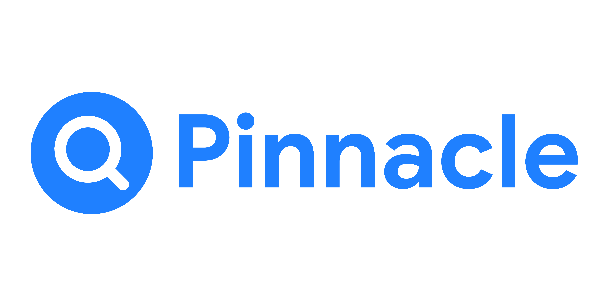

# Pinnacle



**Pinnacle** is an autonomous business intelligence platform powered by AI agents. It takes a business question and returns a complete strategic answer — researching the market, analyzing competitors, modeling data, and generating a ready-to-use strategy report, all without human intervention. Think of it as a research team and strategy consultant running 24/7, at a fraction of the cost.

## Features
- **Autonomous Research**: Scours the web for market trends, competitor data, and relevant information based on your business questions.
- **Data Modeling**: Analyzes complex datasets and provides actionable insights.
- **Strategy Generation**: Automatically generates comprehensive, ready-to-use strategy reports.
- **24/7 Operation**: Always available to answer critical business questions at a fraction of a human consultant's cost.

## Tech Stack
- React
- Vite
- Tailwind CSS
- Lucide React
- shadcn/ui

## Project Structure
- `agents`: Autonomous AI Agent backend (Python ADK) containing Seeker, Crawler, Tracker, Analyst, Planner, Writer, Memory, and Director.
- `src/pages/site`: Public-facing landing pages (Home, etc.)
- `src/pages/auth`: Authentication screens (Login, Signup, Forgot Password, Reset Password)
- `src/pages/legal`: Legal documents (Terms, Privacy, Cookies)
- `src/pages/console`: Internal enterprise platform (Dashboard, Research, Agents, Reports, Settings)
- `src/components/ui`: Reusable UI primitives (shadcn/ui based)
- `src/components/app`: Application-specific global components
- `src/components/console`: Console-specific layout components (ConsoleHeader, ConsoleSidebar)
- `src/assets`: Static graphical assets (icons, logo)

## Getting Started

### Prerequisites
- Node.js (version 18 or higher recommended)
- npm or yarn

### Installation
1. Clone the repository:
   ```bash
   git clone https://github.com/monodox/pinnacle.git
   ```
2. Install dependencies:
   ```bash
   npm install
   ```
3. Copy the example environment file and configure it:
   ```bash
   cp .env.example .env.local
   ```

### Running the Frontend Application
```bash
npm run dev
```

### Running the Multi-Agent Backend
1. Navigate into the `agents` folder.
2. Follow the detailed ADK backend setup and launch instructions in [agents/README.md](agents/README.md).
3. Interact with the multi-agent system using the ADK Web UI:
   ```bash
   adk web --port 8000
   ```

## Contributing
Please read [CONTRIBUTING.md](CONTRIBUTING.md) for details on our code of conduct, and the process for submitting pull requests to us.

## License
This project is licensed under the MIT License - see the [LICENSE](LICENSE) file for details.
